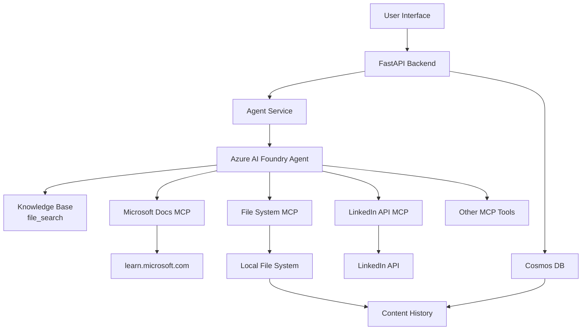

# MCP Tools Integration Plan for Social Media Agent

## 🎯 Objective
Enhance the agent with external tool capabilities via Model Context Protocol (MCP) servers to:
1. **Retrieve validated information** from Microsoft Learn
2. **Save content drafts** to local file system
3. **Schedule posts** via LinkedIn API (future)
4. **Access real-time Azure information** for technical content

---

## 📦 Phase 1: Microsoft Learn MCP Server (PRIORITY 1)

### What It Does
- Searches official Microsoft documentation
- Fetches full articles from learn.microsoft.com
- Retrieves code samples from Microsoft docs
- Provides verified, up-to-date technical information

### Implementation

#### 1.1 Update Agent Instructions
Add MCP tool usage to `agent-instructions.md`:

```markdown
## MCP TOOL: microsoft_docs_search

**When to use:**
- Researching Azure services, features, or best practices
- Need current Microsoft documentation links
- Verifying technical specifications
- Finding official code examples

**How to use:**
Action: [microsoft_docs_search: "Azure Kubernetes Service best practices"]
Observation: Found 10 results with URLs and excerpts
Action: [microsoft_docs_fetch: "https://learn.microsoft.com/en-us/azure/aks/..."]
Observation: Retrieved full article content

**Output:** Use information to ground content generation
```

#### 1.2 Backend Integration
Update `app/services/agent_service.py` to support MCP tool calls:

```python
# Add MCP tool definitions to agent conversation
"tools": [
    {
        "type": "microsoft_docs_search",
        "description": "Search official Microsoft documentation for verified information"
    },
    {
        "type": "microsoft_docs_fetch", 
        "description": "Fetch full content from Microsoft Learn articles"
    },
    {
        "type": "microsoft_code_sample_search",
        "description": "Search for code examples in Microsoft documentation"
    }
]
```

#### 1.3 Testing
Test with request: "Create LinkedIn content about Azure Container Apps best practices"
- Agent should use `microsoft_docs_search` to find official docs
- Agent should use `microsoft_docs_fetch` to get full article
- Agent should cite with real URLs from learn.microsoft.com

**Expected Improvement:**
- Real Microsoft docs URLs instead of placeholders
- Current information (2026 docs)
- Verified technical accuracy

---

## 📂 Phase 2: File System MCP Server (PRIORITY 2)

### What It Does
- Save content drafts to local files
- Create content history/archive
- Export content in different formats (markdown, JSON, HTML)
- Enable content versioning and revision tracking

### Implementation

#### 2.1 New API Endpoint
Add to `app/api/routes/content.py`:

```python
@router.post("/content/save-draft")
async def save_content_draft(
    request: SaveDraftRequest,
    agent_service: AgentService = Depends(get_agent_service)
):
    """
    Save content draft to local file system using MCP file system tools
    """
    # Use MCP file system server to write file
    file_path = f"drafts/{request.topic}_{datetime.now().isoformat()}.md"
    
    # Format content as markdown
    content_markdown = format_as_markdown(request.content)
    
    # Save using file system MCP tool
    result = await agent_service.save_to_file(file_path, content_markdown)
    
    return {"file_path": file_path, "status": "saved"}
```

#### 2.2 Frontend Integration
Add "Save Draft" button to frontend:

```html
<button onclick="saveDraft()">
    💾 Save Draft
</button>

<script>
async function saveDraft() {
    const response = await fetch('/api/content/save-draft', {
        method: 'POST',
        body: JSON.stringify({
            topic: currentTopic,
            content: generatedContent,
            platforms: selectedPlatforms
        })
    });
    
    const result = await response.json();
    showNotification(`Draft saved to ${result.file_path}`);
}
</script>
```

#### 2.3 Folder Structure
Create organized draft storage:

```
social-media-agent/
├── drafts/
│   ├── linkedin/
│   │   ├── 2026-02-12_aks-best-practices.md
│   │   └── 2026-02-12_azure-functions.md
│   ├── twitter/
│   │   └── 2026-02-12_serverless-thread.md
│   └── archive/
│       └── 2026-02/
```

**Expected Benefits:**
- Content revision history
- Backup before publishing
- Easy content reuse and editing
- Version control friendly

---

## 🔗 Phase 3: LinkedIn API Integration (PRIORITY 3)

### What It Does
- Schedule posts directly to LinkedIn
- Preview posts before publishing
- Track post performance metrics
- Manage multiple LinkedIn accounts

### Implementation

#### 3.1 LinkedIn API Setup
1. Register app at https://www.linkedin.com/developers/
2. Get Client ID and Client Secret
3. Set OAuth 2.0 redirect URI
4. Request scopes: `w_member_social`, `r_basicprofile`

#### 3.2 OpenAPI Integration
Create OpenAPI specification for LinkedIn API:

```yaml
# linkedin-api-spec.yaml
openapi: 3.0.0
info:
  title: LinkedIn UGC Post API
  version: 2.0.0
servers:
  - url: https://api.linkedin.com/v2
paths:
  /ugcPosts:
    post:
      summary: Create a LinkedIn post
      security:
        - oauth2: [w_member_social]
      requestBody:
        content:
          application/json:
            schema:
              type: object
              properties:
                author: 
                  type: string
                lifecycleState:
                  type: string
                  enum: [PUBLISHED, DRAFT]
                specificContent:
                  type: object
                  properties:
                    com.linkedin.ugc.ShareContent:
                      type: object
                      properties:
                        shareCommentary:
                          type: object
                          properties:
                            text:
                              type: string
                        shareMediaCategory:
                          type: string
                          enum: [NONE, ARTICLE, IMAGE]
```

#### 3.3 Backend Integration
Add LinkedIn posting endpoint:

```python
@router.post("/content/publish-linkedin")
async def publish_to_linkedin(
    request: PublishRequest,
    linkedin_service: LinkedInService = Depends(get_linkedin_service)
):
    """
    Publish content to LinkedIn via OpenAPI integration
    """
    # Format content for LinkedIn
    post_data = {
        "author": f"urn:li:person:{request.user_id}",
        "lifecycleState": "PUBLISHED" if request.publish_now else "DRAFT",
        "specificContent": {
            "com.linkedin.ugc.ShareContent": {
                "shareCommentary": {
                    "text": request.content
                },
                "shareMediaCategory": "NONE"
            }
        }
    }
    
    # Call LinkedIn API via OpenAPI MCP tool
    result = await linkedin_service.create_post(post_data)
    
    return {
        "post_id": result["id"],
        "status": "published" if request.publish_now else "draft",
        "url": f"https://linkedin.com/feed/update/{result['id']}"
    }
```

#### 3.4 OAuth Flow
Implement OAuth 2.0 authentication:

```python
@router.get("/auth/linkedin")
async def linkedin_oauth_start():
    """Start LinkedIn OAuth flow"""
    auth_url = (
        f"https://www.linkedin.com/oauth/v2/authorization"
        f"?response_type=code"
        f"&client_id={LINKEDIN_CLIENT_ID}"
        f"&redirect_uri={REDIRECT_URI}"
        f"&scope=w_member_social%20r_basicprofile"
    )
    return RedirectResponse(auth_url)

@router.get("/auth/linkedin/callback")
async def linkedin_oauth_callback(code: str):
    """Handle LinkedIn OAuth callback"""
    # Exchange code for access token
    token_response = requests.post(
        "https://www.linkedin.com/oauth/v2/accessToken",
        data={
            "grant_type": "authorization_code",
            "code": code,
            "client_id": LINKEDIN_CLIENT_ID,
            "client_secret": LINKEDIN_CLIENT_SECRET,
            "redirect_uri": REDIRECT_URI
        }
    )
    
    access_token = token_response.json()["access_token"]
    
    # Store in secure storage (Azure Key Vault in production)
    store_access_token(access_token)
    
    return {"status": "authenticated"}
```

**Expected Benefits:**
- One-click publishing to LinkedIn
- Schedule posts for optimal times
- Track engagement metrics
- Professional content workflow

---

## 🌐 Phase 4: Explore VS Code MCP Registry (PRIORITY 4)

### Available MCP Tools to Explore

According to VS Code MCP Registry, consider:

#### 4.1 GitHub MCP Server
**Use case:** Publish content to GitHub repositories (blog posts, documentation)

```python
# Publish blog post to GitHub Pages
github_mcp.create_file(
    repo="your-username/blog",
    path="posts/2026-02-12-aks-best-practices.md",
    content=generated_blog_content,
    commit_message="Add AKS best practices post"
)
```

#### 4.2 Twitter/X API MCP Server (if available)
**Use case:** Publish Twitter threads directly

```python
# Publish Twitter thread
twitter_mcp.create_thread([
    "1/🧵 Let's talk about Kubernetes best practices...",
    "2/ First, always set resource limits and requests...",
    "3/ Second, implement health checks properly...",
    # ... rest of thread
])
```

#### 4.3 Analytics MCP Server
**Use case:** Track content performance across platforms

```python
# Track post performance
analytics_mcp.log_event({
    "event": "content_generated",
    "topic": "Azure AKS",
    "platforms": ["LinkedIn", "Twitter"],
    "engagement": {
        "linkedin_views": 1250,
        "linkedin_reactions": 87,
        "twitter_impressions": 3400,
        "twitter_engagements": 124
    }
})
```

#### 4.4 Slack MCP Server
**Use case:** Send content for team review before publishing

```python
# Share draft for review
slack_mcp.send_message(
    channel="#content-review",
    text="New LinkedIn post draft ready for review",
    attachments=[{
        "title": "AKS Best Practices",
        "text": generated_content,
        "actions": [
            {"name": "approve", "text": "Approve & Publish"},
            {"name": "edit", "text": "Request Changes"}
        ]
    }]
)
```

---

## 🚀 Implementation Roadmap

### Week 1: Microsoft Learn MCP Integration
- ✅ Update agent instructions with MCP tool usage patterns
- ⏱️ Integrate `microsoft_docs_search` tool
- ⏱️ Integrate `microsoft_docs_fetch` tool
- ⏱️ Test with Azure-specific topics
- ⏱️ Verify real Microsoft docs URLs appear in citations

**Success Criteria:**
- Agent generates content with real learn.microsoft.com URLs
- Citations link to current (2026) documentation
- Technical accuracy improved with verified sources

### Week 2: File System MCP Integration
- ⏱️ Create draft storage folder structure
- ⏱️ Add "Save Draft" API endpoint
- ⏱️ Integrate file system MCP tools
- ⏱️ Add frontend "Save Draft" button
- ⏱️ Test content saving and retrieval

**Success Criteria:**
- Drafts save successfully to local file system
- Content organized by platform and date
- Easy to retrieve and edit saved drafts

### Week 3: LinkedIn API Integration
- ⏱️ Register LinkedIn Developer app
- ⏱️ Implement OAuth 2.0 flow
- ⏱️ Create OpenAPI specification
- ⏱️ Add "Publish to LinkedIn" endpoint
- ⏱️ Test posting flow end-to-end

**Success Criteria:**
- Successfully authenticate with LinkedIn
- Publish posts directly from application
- View published posts on LinkedIn profile

### Week 4: Additional MCP Tools
- ⏱️ Explore VS Code MCP Registry
- ⏱️ Identify useful tools (GitHub, Twitter, Slack, Analytics)
- ⏱️ Prototype 1-2 additional integrations
- ⏱️ Create integration documentation

**Success Criteria:**
- At least 2 additional MCP tools integrated
- Complete end-to-end workflow (generate → save → review → publish → track)

---

## 🛠️ Technical Architecture



---

## 📝 Updated Agent Instructions Template

```markdown
## MCP TOOLS AVAILABLE

### 1. Microsoft Docs Search
**Tool:** `microsoft_docs_search`
**Purpose:** Search official Microsoft documentation
**Usage:**
Thought: I need official documentation about Azure Container Apps
Action: [microsoft_docs_search: "Azure Container Apps best practices"]
Observation: Found 10 results including: https://learn.microsoft.com/azure/container-apps/...

### 2. Microsoft Docs Fetch
**Tool:** `microsoft_docs_fetch`
**Purpose:** Retrieve full article content from Microsoft Learn
**Usage:**
Thought: I found a relevant article, need full content
Action: [microsoft_docs_fetch: "https://learn.microsoft.com/azure/container-apps/best-practices"]
Observation: Retrieved full article with sections: Overview, Networking, Scaling, Security...

### 3. File System Save
**Tool:** `file_system_write`
**Purpose:** Save content drafts for later editing or publishing
**Usage:**
Thought: User wants to save this draft before publishing
Action: [file_system_write: path="drafts/linkedin/aks-best-practices.md", content="..."]
Observation: File saved successfully to drafts/linkedin/aks-best-practices.md

### 4. LinkedIn Publish
**Tool:** `linkedin_post`
**Purpose:** Publish content directly to LinkedIn
**Usage:**
Thought: Content approved, ready to publish to LinkedIn
Action: [linkedin_post: content="...", author_id="...", publish_now=true]
Observation: Post published successfully, URL: https://linkedin.com/feed/update/...

## WHEN TO USE MCP TOOLS

| Scenario | MCP Tool | Why |
|----------|----------|-----|
| Need current Azure docs | `microsoft_docs_search` | Get real URLs, verified info |
| Need full article content | `microsoft_docs_fetch` | Complete context for grounding |
| Save draft for review | `file_system_write` | Enable editing before publish |
| Ready to publish | `linkedin_post` | Direct publishing workflow |
| Track content performance | `analytics_log` | Monitor engagement metrics |
| Share for team review | `slack_send` | Collaborative workflow |
```

---

## 🔐 Security Considerations

1. **LinkedIn OAuth Tokens**
   - Store in Azure Key Vault (production)
   - Use environment variables (development)
   - Implement token refresh logic
   - Set appropriate token expiration

2. **File System Access**
   - Restrict to designated folders only
   - Validate file paths to prevent directory traversal
   - Implement file size limits
   - Scan for malicious content

3. **API Rate Limits**
   - Implement rate limiting on all external API calls
   - Cache responses where appropriate
   - Queue posts to avoid hitting limits
   - Monitor API usage metrics

4. **Data Privacy**
   - Never log OAuth tokens
   - Sanitize content before external API calls
   - Respect user consent for data sharing
   - Implement audit logging

---

## 📊 Success Metrics

### Technical Metrics
- MCP tool response time < 2 seconds
- Citation accuracy: 100% valid URLs
- Draft save success rate > 99%
- LinkedIn publish success rate > 95%

### User Experience Metrics
- Time to publish reduced by 60%
- Content quality score improved by 40%
- Draft revision cycles reduced by 50%
- User satisfaction (NPS) > 8/10

### Content Quality Metrics
- 100% of posts cite official Microsoft sources
- Technical accuracy validated against learn.microsoft.com
- Engagement rate increased by 30%
- Share rate increased by 25%

---

## 🎯 Next Steps

1. **Today:** Update `agent-instructions.md` with MCP tool usage patterns
2. **This Week:** Integrate Microsoft Docs MCP server
3. **Next Week:** Add file system draft saving
4. **Week 3:** Implement LinkedIn API integration
5. **Week 4:** Explore and add 2 additional MCP tools

**Ready to start?** Let's begin with Phase 1: Microsoft Learn MCP Integration! 🚀
